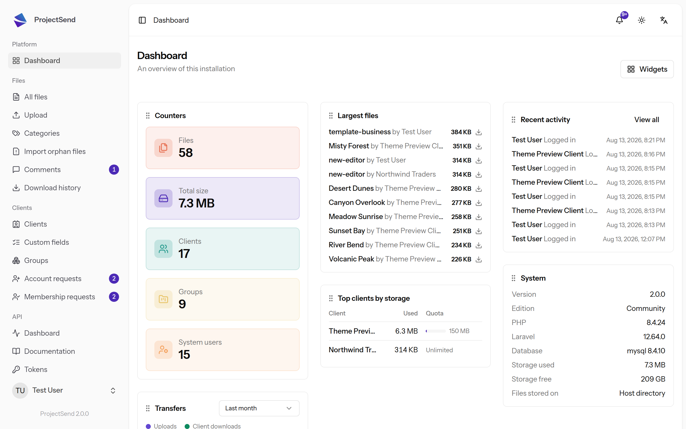
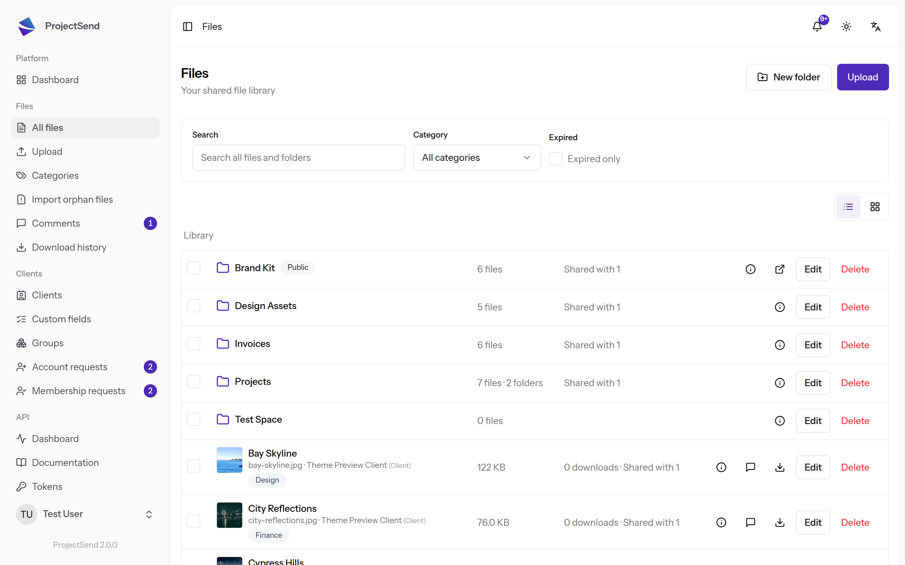
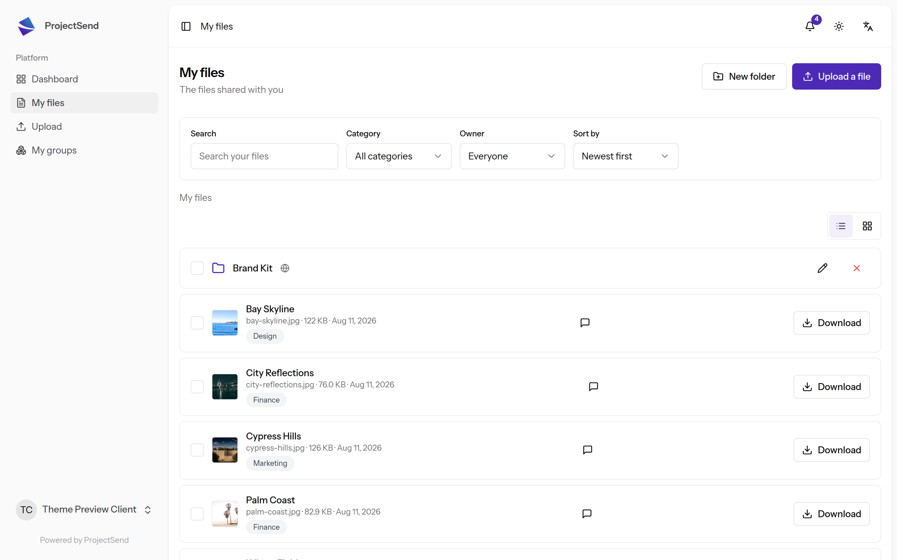

<p align="center">
  
</p>

<h1 align="center">ProjectSend</h1>

<p align="center">
  <strong>Share files with your clients, from your own server.</strong>
</p>

<p align="center">
  <a href="LICENSE"></a>
  
  
</p>

---

ProjectSend is a self-hosted application for getting files to the people you work with. You upload
what you want to send, choose exactly who can see it, and each client signs in to their own private
page to download it.

No public link passed around by email, no third-party service holding your clients' documents, no
per-seat pricing. It runs on your server, and the files stay there.

Prefer not to run the server yourself? [ProjectSend Cloud](https://projectsend.cloud) is the
official hosted version of ProjectSend, run by the same team — every subscription funds this free
software. The line between the free core and Cloud, and the commitments that go with it, are set
out in [LICENSING.md](LICENSING.md).

## What it does

**For the people you send to**
- A private area per client, showing only what has been shared with them
- Sign in with an email address, with optional two-factor authentication
- Search, filter and sort their files; download one, several as a zip, or a whole folder
- Optional comments on a file, so questions live next to the thing they are about
- Email notifications when something new arrives, in their own language

**For you**
- Resumable uploads that survive a dropped connection, so large files actually arrive
- Organise with folders, categories and client groups
- Share with one client, a whole group, or publicly — and set an expiry date or a download limit
- Thumbnails and previews for images and documents
- Storage quotas per client, and custom fields for the details you need to keep on them
- A full activity log and download history: who got what, and when

**For the installation**
- Roles and permissions for your own team, so an uploader is not an administrator
- Sign-in the way you already work: LDAP, social sign-in, or plain email and password
- Themes for the client-facing pages and for outgoing email
- 16 languages
- A REST API with scoped tokens and generated OpenAPI docs
- Privacy controls, including GDPR-grade account erasure with a grace period
- Local disk, S3-compatible storage, or Google Cloud Storage

## Screenshots

<p align="center">
  
</p>
<p align="center"><em>The dashboard — what is in the installation, and what has been happening in it.</em></p>

<p align="center">
  
</p>
<p align="center"><em>Your library — folders, categories, and who each file is shared with.</em></p>

<p align="center">
  
</p>
<p align="center"><em>What your client sees — only their files, nothing else.</em></p>

## Getting started

**With Docker** — the quickest path, and the one we recommend. Nothing to build: the published
image ships with its dependencies and its frontend already compiled.

```sh
curl -O https://raw.githubusercontent.com/projectsend/projectsend/main/docker/production/compose.example.yaml
# edit the passwords and APP_URL in it, then:
docker compose -f compose.example.yaml up -d
```

Open `APP_URL` and the first thing you see is a setup screen that creates your administrator
account — or uncomment `ADMIN_EMAIL` and `ADMIN_PASSWORD` in the file first, with a password of
your own, and it is created for you.

Before you put real files in it, read **[DOCKER.md](DOCKER.md)** — where your database and uploads
actually live, how to move them onto paths you chose, and how to back them up so an upgrade can't
take them with it.

**Without Docker** — for servers where it isn't an option, install from a release zip.
**[INSTALL.md](INSTALL.md)** covers requirements, `.env`, nginx, the background worker and cron,
updating and troubleshooting. You do not need Composer or npm on the server; the zip ships ready to
run.

**Already running it?** **[UPDATE.md](UPDATE.md)** is how you move to a new version — one command
on Docker, one script on your own server, and what to check afterwards either way.

**Want to work on ProjectSend itself?** Cloning the repository gets you a development copy, not an
installation: the dependencies and the compiled frontend are deliberately not in git, so a clone
needs Composer and npm before it runs. **[CONTRIBUTING.md](CONTRIBUTING.md)** has the sequence, and
it is short.

## Coming from ProjectSend Legacy?

The previous generation of ProjectSend lives on at
[projectsend/legacy](https://github.com/projectsend/legacy). This is a rebuild rather than an
upgrade, so moving across is an import rather than an update — install fresh, then bring your old
site into it with the
[migration tool](https://github.com/projectsend/v1-migration-tool): accounts, clients, groups,
categories, folders, files and history.

It never writes to your old install, and any run can be undone with a single command.
**[MIGRATING-FROM-V1.md](MIGRATING-FROM-V1.md)** explains what comes across, the two routes
(same machine, or a portable export from a server you can't reach), and the one change your clients
will notice: they sign in with their email address now, using the same password.

## Contributing

Bug reports, translations and pull requests are all welcome — see
**[CONTRIBUTING.md](CONTRIBUTING.md)** for how to set up a development copy, what the checks are,
and the contributor agreement.

Found a security issue? Please report it privately through GitHub's security advisories rather than
opening a public issue.

## License

Free software under the **GNU General Public License v2, or (at your option) any later version** —
see [LICENSE](LICENSE). Use it, study it, change it, share it.

Commercial licenses are available for organizations that cannot work under copyleft terms;
[LICENSING.md](LICENSING.md) explains both options. Contributions require signing a CLA, for reasons
set out in [CONTRIBUTING.md](CONTRIBUTING.md).
